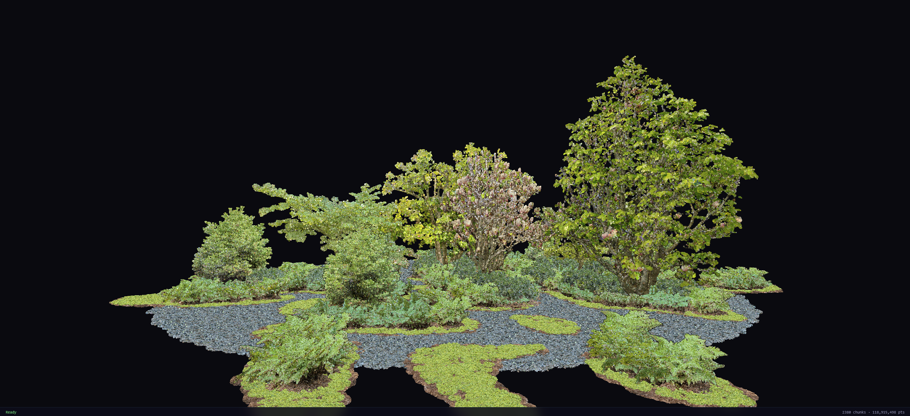

# lazstream

Browser-native LAZ point cloud streaming. Load any LAZ 1.2–1.4 file directly from S3, R2, or Azure Blob — no preprocessing, no tile server, no conversion required.

[Live demo](https://lazstream.stream) · [npm: @lazstream/core](https://www.npmjs.com/package/@lazstream/core) · [npm: @lazstream/viewer](https://www.npmjs.com/package/@lazstream/viewer)


*[Cloud Garden](https://xyz.cct.lsu.edu/cloud-garden/) — LSU Center for Computation & Technology*

---

## What it does

Most point cloud viewers make you preprocess your data first — convert LAZ to COPC, run a tile server, wait for indexing. lazstream skips all of that. Give it a public or pre-signed URL on S3, R2, or Azure Blob and your point cloud is interactive in the browser in seconds, straight from the original file.

The key insight comes from the LAZ format itself: every LAZ file contains a chunk table — a list of byte offsets, one per block of ~50,000 points. By fetching the first raw (uncompressed) point from each block, lazstream builds a sparse overview of the entire file, before decompressing anything. This is the chunk-seed technique from [LidarScout (Erler et al., HPG 2025)](https://doi.org/10.2312/hpg.20251170), adapted for the browser.

From there, full chunks stream in on demand. Each chunk is fetched with an HTTP range request, decoded in a laz-perf WASM worker, and handed to a WebGPU compute shader that depth-tests every visible point — across all loaded chunks simultaneously — in a single GPU dispatch using `atomicMin`. A fixed-size ring buffer (~2 GB by default) holds only what the camera can currently see; chunks evict as you pan away and reload when you return.

```
HTTP range request  →  laz-perf WASM decoder  →  GPU ring buffer  →  WebGPU atomicMin render  →  EDL resolve
```

---

## Use cases

### What it's for

**Viewing raw LAZ files from cloud storage without preprocessing.** Drop an S3, R2, or Azure Blob URL into lazstream and the file is interactive in the browser. No COPC conversion, no tile server, no second copy of your data.

**Sharing an exact view with other people.** The share button encodes the source URL and camera position into a URL fragment (`#v=…`). Anyone with the link lands at the same viewpoint instantly — no account, no installation, nothing to install.

**Building a custom LAZ renderer on a solid streaming engine.** `@lazstream/core` is renderer-agnostic: it handles the network layer, LAZ decoding, spatial index, and IDB caching with no dependency on Three.js or WebGPU. Wire the three provider callbacks to your own renderer — Three.js, Babylon.js, deck.gl, or a bare WebGPU pipeline.

### What it's not

**A replacement for preprocessed formats.** COPC and Potree are significantly more efficient: an octree hierarchy means only the chunks you're looking at are fetched. For a 10 M-point scene lazstream transfers ~40 MB; an equivalent COPC file transfers 8–15 MB. If you control the pipeline and can afford the conversion step, you should use it. lazstream is for files you can't or don't want to preprocess.

**A point cloud editor.** The source file is strictly read-only — lazstream streams and renders, it never writes to, modifies, or re-uploads the LAZ file.

**A viewer for uncompressed LAS files.** Plain `.las` files are rejected with an error. Only compressed LAZ 1.2–1.4 is supported. If your file isn't compressed, run it through `laszip` first.

---

## Packages

| Package | Description |
|---------|-------------|
| [`@lazstream/core`](packages/core) | Renderer-agnostic streaming engine. Handles URL validation, chunk table decoding, seed fetching, worker pool, spatial index, SSE prioritisation, and IDB caching. No Three.js dependency. |
| [`@lazstream/viewer`](packages/viewer) | One-liner WebGPU viewer. Wraps `@lazstream/core` with a WebGPU compute renderer, OrbitControls, Eye-Dome Lighting, and auto camera fit. |

---

## Quick start

```bash
pnpm add @lazstream/viewer three
```

```typescript
import { LazstreamViewer } from '@lazstream/viewer'

const viewer = await LazstreamViewer.create(canvas)
await viewer.load('https://your-bucket.s3.amazonaws.com/scan.laz')
```

See the [viewer README](packages/viewer/README.md) for the full options reference, and the [core README](packages/core/README.md) for bringing your own renderer.

---

## Design

### No preprocessing required

Most point cloud tools require converting LAZ files to a specialised format (COPC, Potree, EPT) before streaming. lazstream reads the original LAZ file directly. The chunk table — a compressed index built into every LAZ file — tells lazstream where each chunk of 50 000 points lives, without downloading the rest of the file.

### No server required

Every network call is a standard HTTP/2 range request. There is no backend, no WebSocket, and no custom protocol. Point lazstream at any public or pre-signed URL on S3, R2, or Azure Blob.

### CORS setup

lazstream runs entirely in the browser and fetches files directly from their origin. Your storage bucket must allow cross-origin requests with the following response headers:

```
Access-Control-Allow-Origin: https://your-viewer.example.com
Access-Control-Allow-Headers: Range
Access-Control-Expose-Headers: Content-Range, Content-Length
```

`Access-Control-Allow-Headers: Range` is required — browsers send it as a preflight on range requests. `Access-Control-Expose-Headers: Content-Range` is required to read the file size; without it the browser hides the header and lazstream cannot determine the file's total byte length.

All major providers (S3, R2, Azure Blob, GCS) support this in their bucket CORS settings.

### Aggressive culling — how large files stay fast

lazstream applies four culling stages in sequence. Each stage eliminates chunks before they consume bandwidth or GPU memory:

1. **SSE threshold** — before fetching anything, each chunk's projected screen height is estimated. Chunks that appear smaller than `sseThreshold` pixels (default 10) are excluded entirely. A chunk at the horizon stays as a seed point; it only decodes when you zoom in.

2. **Frustum filter** — only chunks overlapping the camera's bounding box are even considered. A 7 000-chunk file seen from one end has fewer than 500 chunks in the frustum at any zoom level.

3. **Exact 6-plane cull** — the renderer culls each ring buffer slot against the precise camera frustum before dispatching the GPU compute pass. Only visible slots are rendered and marked as recently-used.

4. **LRU eviction** — slots not rendered for 5 consecutive frames (~83 ms) are evicted from the GPU ring buffer, immediately freeing space for newly visible chunks. The streaming engine re-fetches evicted chunks if the camera returns to them.

The result: a 353 M-point file on a 2 GB ring buffer (~2 900 slots) renders at 60 fps by keeping only the highest-priority visible chunks in GPU memory at any time.

`sseThreshold` and `ringBufferCapacity` are the two primary controls. See the [configuration reference](packages/core/README.md#configuration) for details.

### WebGPU compute for point scale

Point clouds have no triangles. Traditional vertex pipelines require one draw call per point (too slow) or complex instancing (limited). lazstream uses a WebGPU compute shader with `atomicMin` per screen pixel (the Schütz technique): all visible points across all loaded chunks compete for depth in parallel. This scales linearly with GPU throughput — 150M simultaneous points at 60 fps on discrete hardware.

### Eye-Dome Lighting — depth without normals

Point clouds have no surface normals. lazstream uses Eye-Dome Lighting (Boucheny, 2009): a fullscreen pass that reads the depth buffer, samples 4 cardinal neighbours per pixel, and attenuates brightness by the log-depth difference. This gives visible shading at zero preprocessing cost. The shading is scale-invariant — the same settings work on a room-scale scan and a continent-scale survey.

### Renderer-agnostic core

`@lazstream/core` has no Three.js or WebGPU dependency. The streaming engine connects to any renderer through three provider callbacks — camera state, frustum bounding box, and ring buffer pressure. This makes the engine usable with Three.js, Babylon.js, deck.gl, or a custom WebGPU pipeline, without pulling in any rendering library.

---

## Limitations

**WebGPU required.** `@lazstream/viewer` uses WebGPU compute shaders and has no WebGL fallback. Chrome 113+, Edge 113+, and Safari 18+ work out of the box. Firefox requires enabling `dom.workers.modules.enabled` in `about:config`. A WebGL fallback is planned but not yet implemented.

**First loads are network-bound.** Chunks stream in as HTTP range requests — only what the camera frames is fetched. But raw LAZ has no spatial hierarchy, so fully exploring a file means every chunk is eventually requested. A 40 MB file at 3–5 MB/s takes 10–11 seconds of total transfer time once all chunks have been visited. IDB caching (on by default) makes all subsequent views of the same file instant.

**Binary LOD only.** Raw LAZ files store points in scan order, not spatial order. Each chunk is either a single seed point (the overview) or all 50 000–75 000 of its points (full resolution). There is no intermediate level of detail. Zooming in immediately loads full chunks. Files converted to COPC would support continuous progressive refinement, but lazstream currently cannot render COPC files (see below).

**COPC files do not render.** COPC uses LAZ 1.4 layered compression (compressor type 3), which is not supported by laz-perf 0.0.7. A COPC file will load — the header and chunk table parse correctly — but chunk decode fails silently and no points appear. Upgrading laz-perf and adding COPC hierarchy traversal are Phase 5 work items.

**No GPU device-lost recovery.** If the WebGPU context is lost — typically from a sleep/wake cycle, driver crash, or the tab being backgrounded on mobile — a page reload is required. Automatic recovery is not yet implemented.

---

## Browser support

| Browser | Status |
|---------|--------|
| Chrome 113+ | Full support |
| Edge 113+ | Full support |
| Safari 18+ (macOS/iOS) | Full support |
| Firefox | Requires `dom.workers.modules.enabled` flag |

WebGPU is required for `@lazstream/viewer`. `@lazstream/core` works in any browser that supports `Worker` modules.

---

## Repository structure

```
lazstream/
├── packages/
│   ├── core/      @lazstream/core — streaming engine
│   └── viewer/    @lazstream/viewer — WebGPU renderer
├── LICENSE        Apache-2.0
└── README.md
```

---

## Credits

**Techniques**

- **WebGPU atomicMin point rendering** — [Markus Schütz](https://github.com/m-schuetz) (TU Wien). lazstream's compute-shader depth pass is an implementation of his technique for lock-free per-pixel depth competition across millions of points in a single compute dispatch.
- **Eye-Dome Lighting** — Boucheny (2009), 4-cardinal-neighbour log-depth variant as implemented by [Potree](https://github.com/potree/potree). The resolve pass in lazstream follows the same formulation.
- **Chunk-seed instant overview** — Erler, Schütz, Wimmer. *LidarScout: Direct Out-of-Core Rendering of Massive Point Clouds.* HPG 2025. [doi:10.2312/hpg.20251170](https://doi.org/10.2312/hpg.20251170)

**Libraries**

- **[laz-perf](https://github.com/connormanning/laz-perf)** — Connor Manning / hobu Inc. The WASM LAZ decoder lazstream runs in every decode worker.
- **[Three.js](https://threejs.org)** — camera, OrbitControls, and frustum math in `@lazstream/viewer`. Not used for rendering points.
- **[rbush](https://github.com/mourner/rbush) / [rbush-3d](https://github.com/nicktindall/rbush-3d)** — Vladimir Agafonkin's R-tree (2D), adapted to 3D. The spatial index backing chunk prioritisation and frustum culling in `@lazstream/core`.

---

## License

Apache-2.0 — see [LICENSE](LICENSE).
